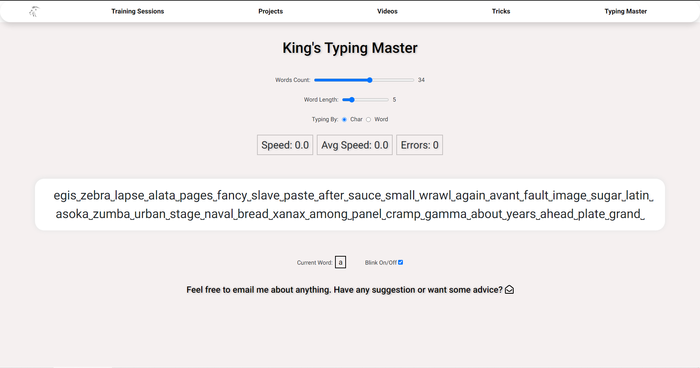

<p align="center">
  <a href="https://kingtechnologies.in/Typing%20Master" title="Typing Master">
    
  </a>
</p>
<h1 align="center">🌟 Typing Master 🌟</h1>
<p align="center">Enhance your Typing speed according to you</p>

<p align="center">
<a href="https://github.com/Rohit19060/typing-master/blob/master/LICENSE" title="License">

</a>
<a href="https://github.com/Rohit19060/typing-master/fork" title="Forks">

</a>
<a href="https://github.com/Rohit19060/typing-master/stargazers" title="Stars">

</a>
<a href="https://github.com/Rohit19060/typing-master/issues" title="Issues">

</a>
<a href="https://github.com/Rohit19060/typing-master/pulls" title="Pull Requests">

</a>
<a href="https://github.com/Rohit19060/typing-master" title="Repo Size">

</a>
<a href="https://discord.gg/2wpHNSjwm2" title="Join King Tech's Community">

</a>
</p>

<p align="center" title="Typing Master"></p>

<h2 align="center">🌐 Links 🌐</h2>
<p align="center">
    <a href="https://github.com/Rohit19060/typing-master" title="Typing Master Repo">📂 Repo</a>
    ·
    <a href="https://kingtechnologies.in/Typing%20Master" title="Visit">✨ Live View</a>
    ·
    <a href="https://github.com/Rohit19060/typing-master/issues/new/choose" title="🐛Report Bug/🎊Request Feature">🚀 Got Issue</a>
</p>

## 🚀 Features

- **Typing Speed Enhancer**

- **Capital letters and Numbers**

- **Word length and count edits**

- **Based on Char or Word**

- **You can set current Focus Word**

- **Simple and Minimalistic UI**

## 🦋 Prerequisite

- Basic Understanding of [HTML](https://youtu.be/JHv2jmnrLlA "HTML - First Step Towards Web Development")

- Basic Understanding of [CSS](https://youtu.be/d1tP7ow7HbQ "CSS - Second Step Towards Web Development")

- Basic Understanding of JavaScript

- Basic Understanding of [webpack](https://webpack.js.org/ "webpack")

- Basic Understanding of [Node](https://nodejs.org/ "Node")

- Basic Understanding of [NPM](https://www.npmjs.com/ "NPM")

## 🛠️ Installation Steps

1. Clone the repository

```Bash
git clone https://github.com/Rohit19060/typing-master.git
```

2. Change the working directory

```Bash
cd typing-master
```

3. Install Dependencies

```Bash
npm i
```

4. Run the app using terminal

```Bash
npm start
```

**🎇 You are Ready to Go!**

## ❗ Available Commands

```Bash
npm start
```

This command will execute `webpack serve --open chrome`. This app is developed with Webpack so, It will launch the app using the Webpack server. Because the `open chrome` option passed with the command, it will also open the app in chrome. Runs the app in the serving mode. Open [http://localhost:3000](http://localhost:3000) to view it in any browser.

```Bash
npm run build
```

This command will execute `webpack`. Builds the app for production to the `docs` folder. It correctly bundles all the files and assets in production mode and optimizes the build for the best performance. You can use any server to serve the app in production mode.

```Bash
npm run dev
```

This command will execute `webpack --watch`. It is Webpack watch mode where the app gets compiled automatically whenever you make a change in the src files. You can use any server to serve the files. With the help of `Live Server`, you can make your development process very fast.

## 👷 Built with

- [HTML](https://youtu.be/JHv2jmnrLlA "HTML - First Step Towards Web Development"): For Creating Markup

- [CSS](https://youtu.be/d1tP7ow7HbQ "CSS - Second Step Towards Web Development"): For Designing

- JavaScript: For Writing, scripts to get the repos

- [webpack](https://webpack.js.org/ "webpack"): As module bundler. Webpack takes modules with dependencies and generates static assets representing those modules.

- [NPM](https://www.npmjs.com/ "NPM"): Package Manager

- [Node](https://nodejs.org/en/ "Node"): JavaScript runtime

## 📂 Directory Structure

- [`./src/index.js`](https://github.com/Rohit19060/typing-master/blob/main/src/index.js "Script"): Main script file

- [`./src/style.css`](https://github.com/Rohit19060/typing-master/blob/main/src/style.css "Style"): Main Style file, Contain all the styles of the app

- [`./index.html`](https://github.com/Rohit19060/typing-master/blob/main/index.html "Typing Master"): Production main entry file

## 🎊 Future Updates

- [ ] Reliable Storage

## 🧑🏻 Author

**Rohit Jain**

- 🌌 [Profile](https://github.com/Rohit19060 "Rohit Jain")

- 🏮 [Email](mailto:rohitjain19060@gmail.com?subject=Hi%20from%20Typing%20Master "Hi!")

- 🦁 [Website](https://kingtechnologies.in "Welcome")

<h2 align="center">🤝 Support</h2>

<h3 align="center">🎀 Contributions (<a href="https://guides.github.com/introduction/flow" title="GitHub flow">GitHub Flow</a>), 🔥 issues, and 🥮 feature requests are most welcome!</h3>

<h3 align="center">💙 If you like this project, Give it a ⭐ and Share it with friends!</h3>
<h3 align="center">💰 Donations Links</h3>
<p align="center">
<a href="https://www.paypal.me/kingrohitJ" title="PayPal"></a>
<a href="https://www.buymeacoffee.com/rohitjain" title="Buy me a Coffee"></a>
<a href="https://ko-fi.com/rohitjain" title="Ko-fi"></a>
<a href="https://www.patreon.com/KingTechnologies" title="Patreon"></a>
</p>

<p align="center">Made with JavaScript & ❤️ in India</p>
